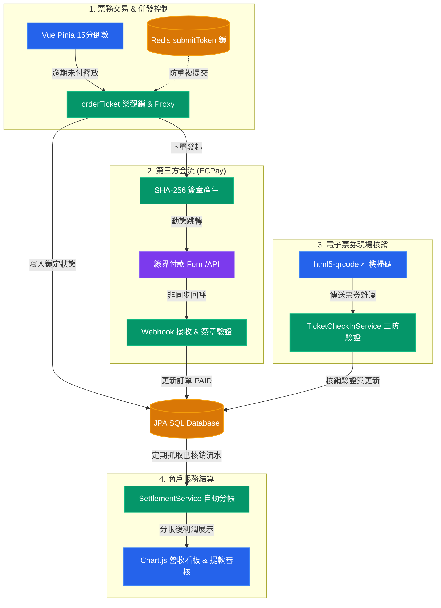
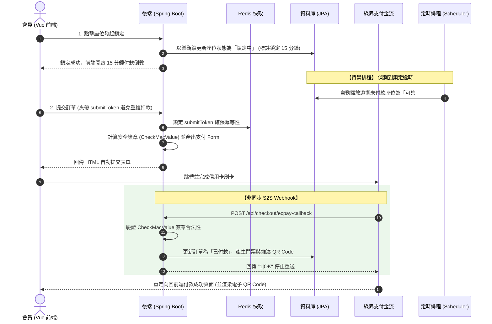

# TAP — Ticket Access Platform

售票 / 拍賣 / 周邊商品的整合平台。採用「一個後端 + 兩個前端(一般使用者站、管理後台) + 基礎設施(資料庫 / 快取 / 訊息佇列 / 監控)」的 monorepo 架構。

> 因為我們團隊初期開發時，將資料庫機敏資訊一起推上了 GitHub。發現這個資安漏洞後，為了徹底清除紀錄，我們決定將歷史 Commit 抹除並重新上傳乾淨的版本。
> 這是一份可公開的乾淨版原始碼:已移除開發日誌、實名認證文件等個資與真實金鑰。所有機密改由環境變數注入,預設值僅供本機開發,**正式環境務必覆蓋**。

---

## 技術棧

| 層 | 技術 |
|---|---|
| 後端 | Java 21、Spring Boot 3.5、Spring Data JPA、Spring Security、JWT、Spring Data Redis、Spring AMQP(RabbitMQ)、Spring Mail、Cloudinary、Actuator + Micrometer/Prometheus。打包為 **war**,Maven Wrapper 同梱。 |
| 資料庫 | Microsoft SQL Server 2025(容器內建置) |
| 一般使用者前端 | Vue 3 + Vite、Pinia、Vue Router、Axios、Bootstrap、Element Plus、SweetAlert2、html5-qrcode(掃碼入場)、Cropper.js、Swiper |
| 管理後台前端 | Vue 3 + Vite、Chart.js、md-editor-v3、xlsx(匯出 Excel)、dayjs |
| 基礎設施 | SQL Server、Redis、RabbitMQ、MailDev(開發用信箱)、Prometheus、Grafana |

---

## 專案結構

```
.
├── backend/              # Spring Boot 後端 (Java 21, Maven)
│   ├── src/main/resources/
│   │   ├── application.properties        # 主要組態 (吃 ${ENV} 環境變數)
│   │   ├── application-prod.properties    # 正式環境覆蓋範例
│   │   ├── schema.sql                     # 每次啟動 DROP+CREATE 所有資料表
│   │   └── data.sql                       # 測試/展示用種子資料
│   └── documents/        # 後端讀寫的檔案 (系統文件、Email 樣板、公開圖片種子)
├── frontend/             # 一般使用者站 (Vue 3 + Vite)
├── frontend-admin/       # 管理後台 (Vue 3 + Vite)
├── sqlserver/            # SQL Server 容器 (Dockerfile / entrypoint / init.sql)
├── monitoring/           # Prometheus 設定
├── k6/                   # 壓力測試腳本 (.js;k6 執行檔請自行安裝)
├── docker-compose.yml            # 基礎設施 (DB / Redis / RabbitMQ / MailDev)
└── docker-compose.monitoring.yml # 監控 (Prometheus / Grafana / redis-exporter)
```

---

=============================================================================

## 核心開發模組與技術

本專案中，我獨立負責 **「高併發票務交易系統」、「綠界科技金流整合」、「現場安全核銷系統」與「商戶帳務自動結算平台」** 的全棧架構設計與開發。
以下為核心功能摘要：

### 1. 核心負責範圍與架構

```
TAP-ticket-access-platform (核心研發範圍)
├── 🖥️ frontend (Vue 3 前端)
│   ├── views/PaymentTicket.vue        (實名購票交易與 15 分鐘精準倒數)
│   ├── views/OrderTicketCheckIn.vue   (現場相機掃碼核銷端)
│   └── views/OrganizerSettlement.vue  (主辦方營收看板與結算申請)
└── ⚙️ backend (Spring Boot 後端)
    ├── orderTicket/                   (高併發票務模組)
    │   ├── TicketOrderCreateService   (UUID 冪等性、JPA 效能優化與座位鎖定)
    │   ├── OrderCleanupScheduler      (Spring Task 定時釋放未付款座位庫存)
    │   └── TicketCheckInService       (防偽防重複掃碼核銷業務邏輯)
    ├── payment/ecpay/                 (通用金流整合模組)
    │   ├── EcpayPaymentService        (AIO 信用卡交易表單生成與 SHA-256 簽章計算)
    │   └── EcpayCallbackController    (接收綠界 S2S Webhook 非同步安全通知與分發)
    └── settlements/                   (商戶財務結算模組)
        └── SettlementService          (自動化營收對帳、比例抽成與財務指標聚合)
```

---

### 2. 核心業務功能與技術實現

| **功能模組** | 技術層 (Frontend / Backend) | 技術要點與實作機制 |
| :--- | :--- | :--- |
| **票務交易與併發控制** | Frontend Vue 3 + Backend `orderTicket` | <ul><li>**高併發防超賣**：座位狀態在 DB 進行庫存鎖定（透過 JPA 樂觀鎖 `@Version` 驗證），並於前端 Pinia 實作 15 分鐘倒數。</li><li>**排程庫存回收**：利用 Spring Task 定時掃描並自動還原過期未付款之座位庫存。</li><li>**介面冪等性防護**：下單時前端帶入 UUID `submitToken`，後端透過 Redis 進行分散式鎖定攔截，防止重複點擊結帳。</li><li>**效能優化**：利用 JPA Proxy (`getReference`) 避免無謂的關聯表查詢，提升高頻寫入效能。</li></ul> |
| **第三方金流整合** | Backend `payment` (ECPay) | <ul><li>**防篡改加密**：基於綠界 API 規範計算 SHA-256 簽章（`CheckMacValue`）並動態產生自動跳轉之 HTML Form。</li><li>**可靠的非同步 Webhook**：實作 S2S Webhook 非同步通知接口，嚴格驗證簽章，並根據交易單號前綴（票券/周邊）進行動態分發，修改狀態後回傳 `1\|OK` 阻斷金流重複發送。</li></ul> |
| **現場電子票券核銷** | `OrderTicketCheckIn.vue` + `TicketCheckInService` | <ul><li>**相機掃碼與防偽**：前端調用 `html5-qrcode` 呼叫相機解碼，後端檢驗 QR Code 雜湊與狀態。</li><li>**高安全核銷**：嚴格防範「一票多用」、「重複核銷」與「退票入場」，核銷通過即時更新狀態並寫入核銷時間。</li></ul> |
| **商戶帳務結算** | `OrganizerSettlement.vue` + `settlements` | <ul><li>**SaaS 自動分帳**：依主辦方抽成比例自動計算平台抽成與淨利潤，產出結算單。</li><li>**營收看板與閉環**：整合 Chart.js 呈現日/月營業趨勢，主辦方可發起撥款申請，由平台管理員審核撥款，完成商業閉環。</li></ul> |

> 💡 **互動式視覺化工具**：我們已為這四個核心業務模組設計了動態互動式的網頁流程圖！  
> 👉 [**🌐 點此開啟「核心業務與架構互動式流程圖」網頁版**](file:///c:/Users/davin/Desktop/偉宏/職訓/期末專題/開發/TAP-ticket-access-platform/docs/architecture-flowchart.html)

#### 核心業務模組關聯與流向圖 (Mermaid)



---

## 核心交易與金流運作機制

### 1. 購票鎖定與支付 Webhook 運作流程


### 2. 現場核銷與營收結算流程

*   **安全防偽核銷**：
    現場人員透過手機端調用 `html5-qrcode` 掃描門票。後端 `TicketCheckInService` 執行三防校驗：
    1. **防無效**：檢驗資料庫中該門票的 QR Code 雜湊值是否存在。
    2. **防退票**：檢驗該門票狀態是否為「已付款（PAID）」且未申請退款。
    3. **防多用**：校驗 `is_used` 狀態，若是 `Redeemed`（已使用）則拒絕入場，防止二度核銷與複製票券。
*   **商戶帳務結算**：
    `SettlementService` 定期拉取已核銷之交易流水，依各主辦方合約抽成比例計算平台抽成與主辦方淨營業額，建立撥款申請。管理員確認無誤後手動/自動撥付，完成 SaaS 平台的財務閉環。